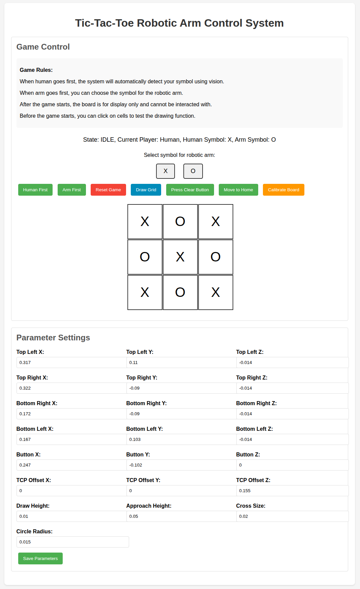
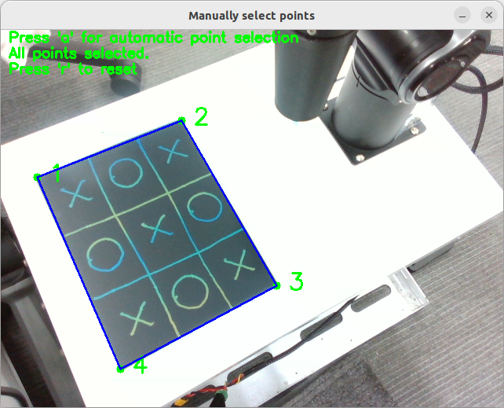

# TicTacToe_PiPER

This project uses the PiPER robotic arm to implement the function of playing Tic-Tac-toe. You are welcome to reproduce it and have fun.

<td ><center></center></td>

## Feature Demonstration

## Repository

- **Navigation**: https://github.com/agilexrobotics/Agilex-College
- **Project**: https://github.com/kehuanjack/TicTacToe_PiPER

## Requirements

- PiPER
- CAN module
- Ubuntu 22.04
- ROS2 (Humble)
- [Drawing board](images/2.png)
- Intel Realsense camera

## Start the game

1. Install the `piper_sdk` and `Flask`:

    ```bash
    pip3 install piper_sdk flask
    ```

2. Install the `realsense2_camera`:

    ```bash
    sudo apt install ros-humble-librealsense2*
    ```

3. Clone the repository:

    ```bash
    git clone -b humble https://github.com/kehuanjack/TicTacToe_PiPER.git
    cd TicTacToe_PiPER/src
    git clone -b humble https://github.com/agilexrobotics/piper_ros.git
    cd ../
    ```

4. Build and source the ROS workspace:

    ```bash
    colcon build
    source install/setup.bash
    ```

5. Connect the Intel Realsense camera, PiPER, and CAN module, and activate CAN:

    ```bash
    bash can_activate.sh
    ```

6. Start the game (to ensure the actuator is not damaged, it is recommended to remove the end effector during the first start, because the arm will move to the initial position set in the board_params.yaml file):

    ```bash
    ros2 launch tic_tac_toe tic_tac_toe.launch.py
    ```

7. Open the game page in your browser: http://127.0.0.1:5000.

    

8. Please place your camera on the left side of the robotic arm. Set the corners of the board through the "Manually select points" window: you can press "a" for automatic selection, or click on a corner of the board to select manually, and press "r" to reset the selection. The order of manual point selection: upper left, upper right, lower left, lower right.

    

## Notice

- You can adjust the parameters in the configuration file `config/board_params.yaml`.

- You can adjust the camera exposure in the launch file `launch/tic_tac_toe.launch.py`.

- You need to rebuild the workspace after modifying the configuration or launch files.

- You need to avoid reflections from the board and minimize the effects of ambient light.